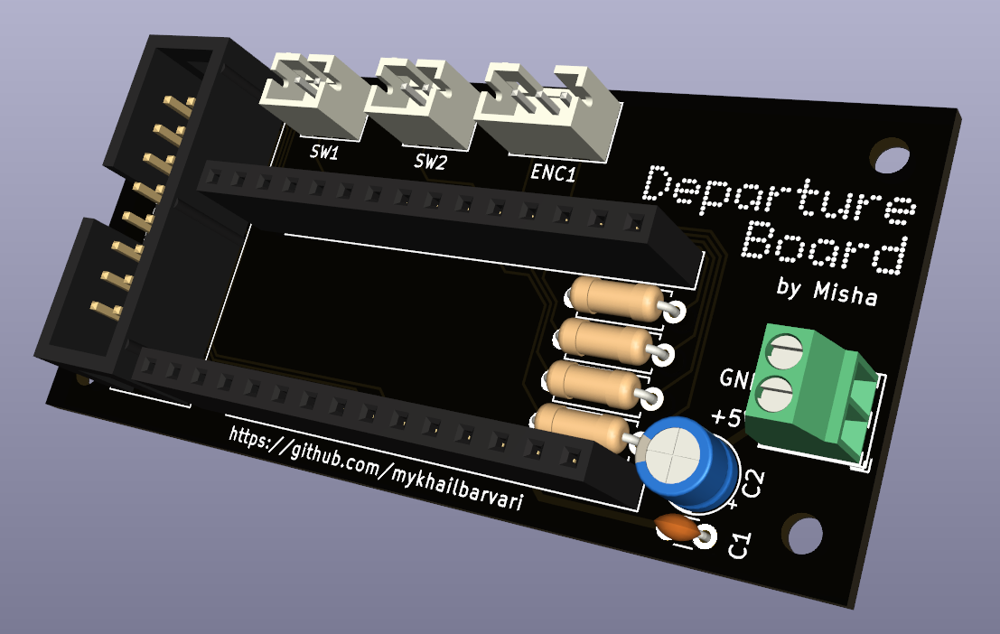
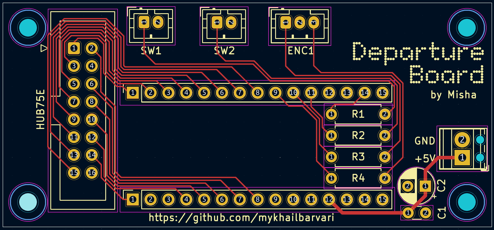

# Departure Board – ESP32 Transit Display
## 🚧🚧🚧 WORK IN PROGRESS🚧🚧🚧
A real-time LED departure board built as my first personal embedded systems project.

The system runs on a "[ESP32-S3 Nano](https://www.waveshare.com/wiki/ESP32-S3-Nano)" by Waveshare and drives two daisy-chained [HUB75E LED matrix panels](https://www.waveshare.com/wiki/RGB-Matrix-P2-64x64) to display live public transport departure data.

This project marks as my first personal project. Transitioning from theory to building real, physical systems.

---

## Why this project?
After finishing the courses IS1300 Embedded Systems and IS1200 Computer Hardware Engineering at my university, I wanted to move beyond course assignments and theory and build something with practical, everyday use.

During the winter, bus traffic became irregular due to snow, and I often found myself standing in the cold because the scheduled departure times were inaccurate.
That’s when I realized how useful a real-time, always-on departure display would be.

Beyond functionality, I wanted to build something I would actually want to keep in my home. Something useful, but also nice to look at and be proud to show friends.

While searching for inspiration online, I stumbled upon the departure boards built by 
[T-Skylt](https://shop.t-skylt.se/). Their work was a major source of inspiration for this project, especially in terms of concept and overall aesthetic.

---

## What does it do?
- Fetches real-time departure data from the [Trafiklab API](https://www.trafiklab.se/)
- Drives two daisy-chained 64×64 P2 HUB75E LED matrix panels
- Renders text on a high-refresh, DMA-driven LED display
- Uses a rotary encoder to navigate a simple on-device UI menu
- Runs separate FreeRTOS tasks for data fetching, display rendering, and UI logic

---

## Hardware
- [ESP32-S3 Nano (Waveshare)](https://www.waveshare.com/wiki/ESP32-S3-Nano)
- [RGB LED Matrix P2 64×64 (HUB75E)](https://www.waveshare.com/wiki/RGB-Matrix-P2-64x64) ×2 (daisy-chained)
- External 5V high-current power supply
- Custom HUB75E bonnet PCB (designed for this project)
- Rotary encoder for on-device navigation
- On/off power switch
- Custom 3D-printed chassis (CAD designed)

---

## Software
- Visual Studio Code with the [PlatformIO](https://platformio.org/) extension
- Arduino framework (ESP32)
- FreeRTOS
- [HUB75E LED display driver](https://github.com/mrcodetastic/ESP32-HUB75-MatrixPanel-DMA) (by mrcodetastic)  
- ArduinoJson

---

## Custom PCB

Strictly speaking, this project did not require a custom PCB.
There are many existing HUB75 bonnets and breakout boards for the Nano DevKit form factor that would have worked just fine.

However, I chose to design a custom PCB to reduce cable clutter and minimize the physical footprint of the system.
More importantly, I wanted an introduction to PCB design and the basic workflow in KiCad.
Being able to see something I designed myself work as a real, physical part of the project was a big motivation.

Designing my own HUB75E bonnet PCB therefore became a natural step.

The PCB acts as a dedicated interface between the ESP32-S3 Nano and the LED matrix panels, keeping signal routing clean and making assembly much easier compared to loose jumper wires.

I designed both the schematic and the PCB layout in KiCad and ordered the board as part of the learning process.
The finished design was exported to Gerber files and manufactured via [JLCPCB](https://jlcpcb.com/).

### Revision note
My first PCB revision wasn’t perfect.
I miscalculated the dev board length, which caused clearance issues with the HUB75E connector.
As a workaround, I replaced the HUB75E connector with a horizontal 16-pin GPIO header for the panel connection.

This turned out to be a valuable lesson in mechanical constraints and the importance of validating physical dimensions early in the design process.

This was my first PCB design, and it taught me a lot about planning, layout constraints, and thinking about both electronics and physical integration at the same time.

## PCB Images

<table>
  <tr>
    <td align="center">
      <b>3D PCB Model</b> 
      
    </td>
    <td align="center">
      <b>PCB Layout</b> 
      
    </td>
  </tr>
</table>

